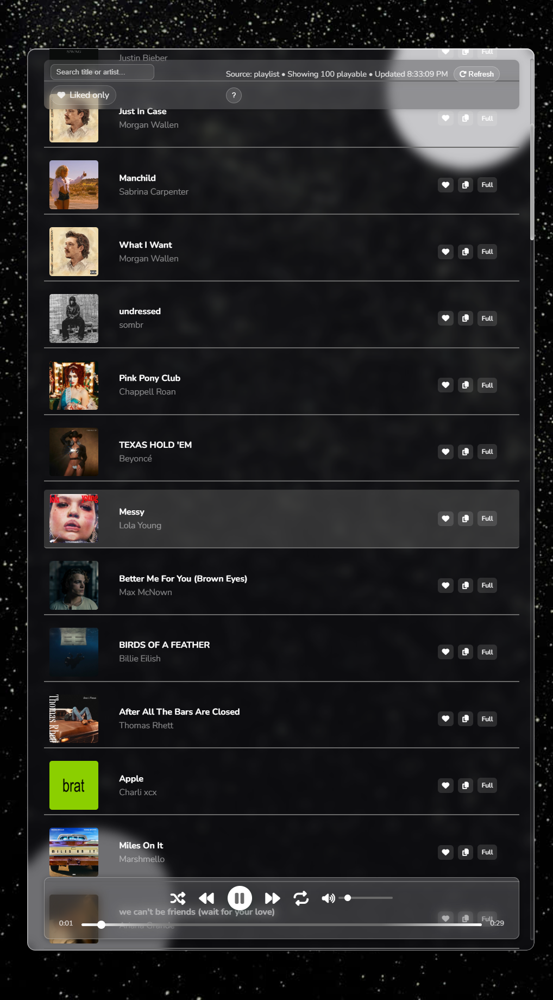
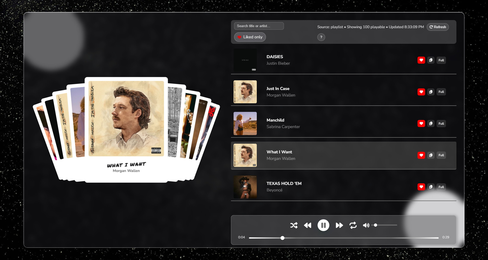
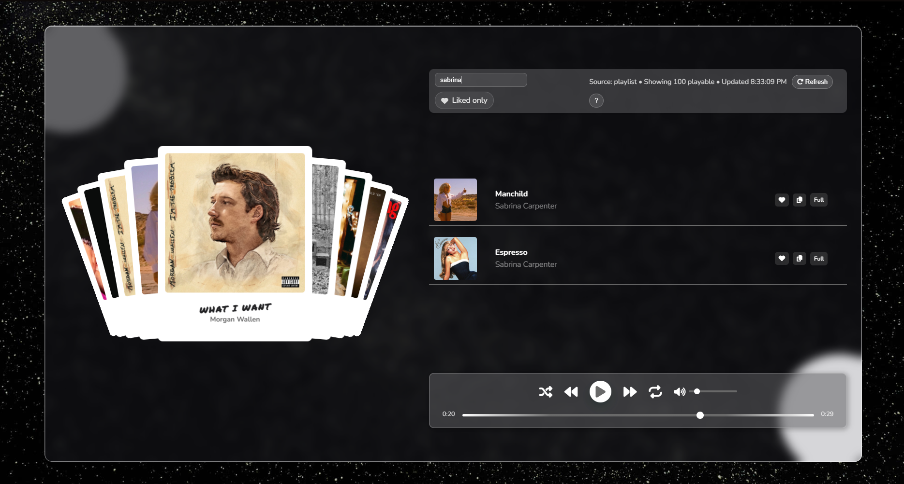
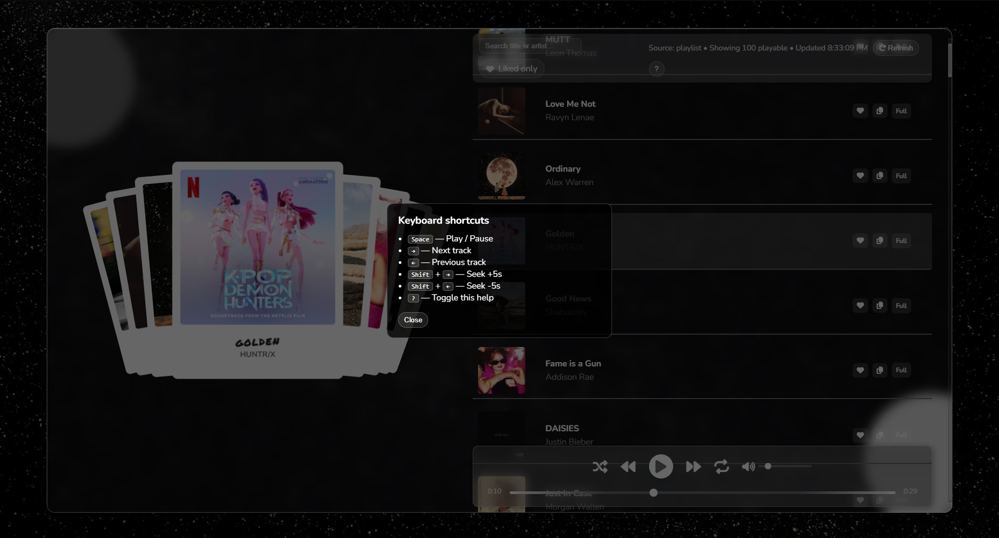

# Deezer-Top-100-Daily-Player by Filip Ilovsky

An immersive, swipable music player that streams **Deezer’s Top 100 worldwide tracks**, **updated automatically** every day.  
Built with a modern **HTML**, **CSS**, and **JavaScript** **frontend** and a **lightweight Node.js backend server**, it transforms **raw chart data** into a seamless, interactive listening experience.


## ✨ Features

- **Daily auto-updated Top 100** – backend server fetches the freshest Deezer worldwide charts every day.

- **Preview-only playback (copyright compliant)** – streams official 30-second previews, respecting music licensing rules.

- **Shuffle & repeat-current modes** – with clear “ON” states for instant feedback.

- **Preloaded next track** – upcoming audio is preloaded for snappy, seamless playback.

- **Swipable cover deck** – interactive card-style browsing powered by Swiper.js.

- **Scrollable, responsive playlist** – filter by search or liked-only for quick navigation.

- **Sticky toolbar & player** – top filters and bottom controls stay accessible at all times.

- **Smart auto-scroll** – active track always stays visible, never hidden under the toolbar or player.

- **Node.js backend proxy** – bypasses Deezer CORS restrictions for secure, reliable API access.

- **Auto-refresh with visibility awarenes** – updates every 30 minutes only when the tab is active, avoiding wasted requests.

- **Duplicate & invalid tracks removed** – playlist contains only playable previews.


- **LocalStorage preferences** – volume, shuffle, repeat, liked songs, and last played track all saved between sessions.

- **Playback resumes where you left off** – even after closing or refreshing the browser.

- **Full keyboard support** – intuitive shortcuts for faster control:

  - `Space` - Play / Pause

  - `→`/ `←` - Next / Previous track

  - `Shift + →` / `Shift + ←` - Seek ±5s

  - `?` - Toggle help overlay

- **ARIA labels & tooltips** – designed with accessibility in mind.

- **Liked songs system** – save favorites and instantly filter to view only your liked tracks.


## 🎥 Demo








## 🚀 How to Run

1. Clone this repository:
   ```bash
   git clone https://github.com/Filip-2002/Deezer-Top-100-Daily-Player.git
   cd Deezer-Top-100-Daily-Player
   ```

2. Start the Backend (Node.js server):
   The backend acts as a proxy to Deezer’s API and auto-updates the Top 100 playlist.
   ```bash
   cd backend
   npm install
   node server.js
   ```

   By default, the server runs at:
   ```bash
   http://localhost:3000
   ```

3. Open `frontend\index.html`

   The backend (`node server.js`) must be running for the player to fetch Deezer tracks. If the backend is not started, the playlist will not load.


## ⚠️ Notes

- The app requires the backend server to be running (`node server.js`) for the frontend player to fetch daily updated tracks.

- Local playback state (liked songs, shuffle/repeat mode, last played track, volume) is saved in the browser using localStorage, playback state is not shared between users.

- There is n databse, all persistence is local-only (localStorage). This was a design choice to keep the app lightweight and simple to run.

- The backend is a lightweight proxy for Deezer’s API. No personal data is stored or transmitted.

- Designed so new playlists or charts can be added easily by changing API parameters.

- The playlist updates automatically every 24 hours to reflect Deezer’s Top 100 worldwide chart.

- Responsive design:
  - On smaller screens the card deck hides automatically to prioritize the playlist and player.
  - On large screens, the deck is always visible and centered alongside the playlist.

- Tested on **Windows**, **MacBook**, and **Linux**, minor spacing may differ slightly depending on screen resolution.

- No external frameworks, this is entirely built with **vanilla HTML**, **CSS**, and **JavaScript**, except for the backend proxy (**Node.js** + **Express**).